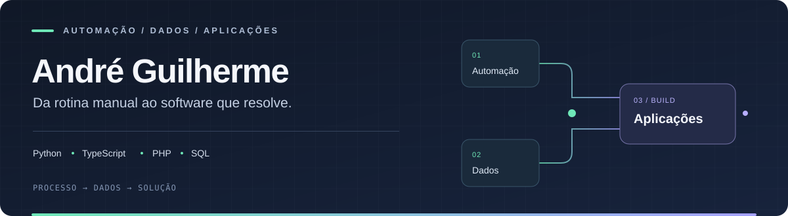

  

Se eu tenho que fazer a mesma coisa toda hora, começo a procurar um jeito de não fazer mais.

Às vezes sai um script. Às vezes um bot. Às vezes eu só queria arrumar uma coisa e acabo montando um sistema inteiro.

Aqui tem um pouco disso: **automação pra tarefa chata, painel pra entender a bagunça e umas ideias que acabaram virando projeto.**

### 🏀 Meu foco agora: Hoops Manager

Meu projeto atual é o **Hoops Manager**, um jogo de gestão de basquete que estou preparando para lançar na **Steam**.

É onde estou colocando mais tempo e energia agora. O projeto tem código fechado, e as novidades ficam no **[hoopsmanager.com.br](https://hoopsmanager.com.br)**.

### Alguns armengues da casa

| O que saiu | Pra que serve |
| :--- | :--- |
| **[FinanceFlow](https://github.com/11guigamartins-cloud/financeflow)** | Pra organizar receitas, despesas, cartões e parcelas sem se perder nas contas. [Abrir ↗](https://financeflow-cyan.vercel.app) |
| **[StockMaster / EstoCaixa](https://github.com/11guigamartins-cloud/stockmaster)** | Caixa, estoque, vendas e clientes no mesmo lugar. Pra ajudar a organizar a rotina de uma loja. |
| **[UFC Manager](https://github.com/11guigamartins-cloud/ufcmanager)** | Um simulador de MMA com lutadores, estratégias e lutas por round. Porque nem todo projeto precisa ser sobre trabalho. |

### No meio do caminho também tem

- Planilha que precisa conversar com banco de dados.
- Portal que precisa ser consultado todo dia — aí entra a automação.
- Alarme, prazo, backlog e indicador de telecom pra acompanhar.
- O **Fibrinho**: bot de Telegram e portal pra consultar ocorrências e acompanhar a operação.

Algumas dessas coisas ficam nos sistemas internos e não aparecem nos repositórios daqui.

O que tem debaixo do capô

Python, SQL, PHP, JavaScript e TypeScript. Também aparecem React, Flask, Streamlit, Pandas, Playwright e o que mais ajudar a resolver a bronca.

